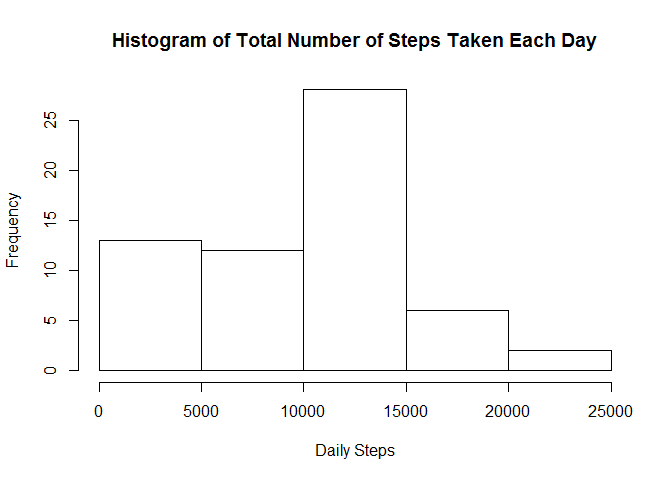
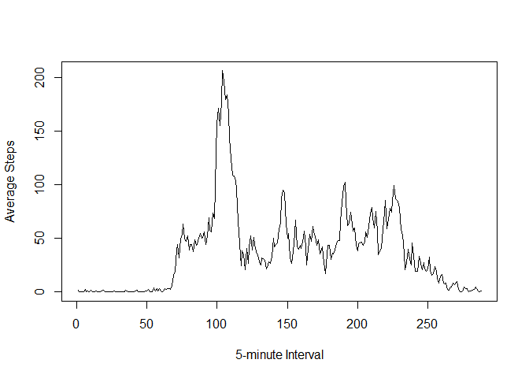
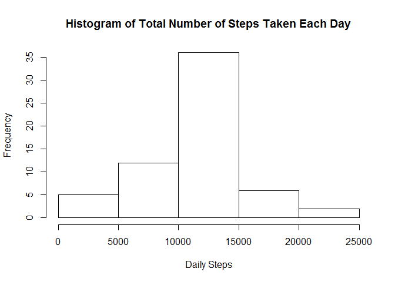
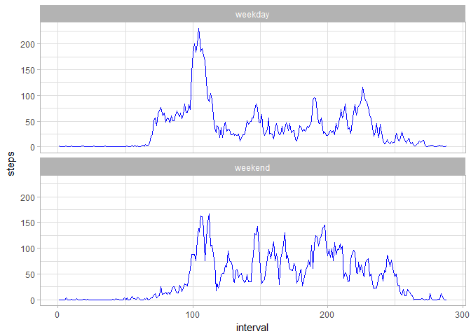

## Loading and preprocessing the data
First we are going to load the sensor data

```r
act <- read.csv("activity.csv")
str(act)
```

```
## 'data.frame':	17568 obs. of  3 variables:
##  $ steps   : int  NA NA NA NA NA NA NA NA NA NA ...
##  $ date    : Factor w/ 61 levels "2012-10-01","2012-10-02",..: 1 1 1 1 1 1 1 1 1 1 ...
##  $ interval: int  0 5 10 15 20 25 30 35 40 45 ...
```
Then we convert the "date" to Date class and "interval" to factor class

```r
act$date <- as.Date(act$date, format="%Y-%m-%d")
str(act)
```

```
## 'data.frame':	17568 obs. of  3 variables:
##  $ steps   : int  NA NA NA NA NA NA NA NA NA NA ...
##  $ date    : Date, format: "2012-10-01" "2012-10-01" ...
##  $ interval: int  0 5 10 15 20 25 30 35 40 45 ...
```

```r
MissingSteps <- sum(is.na(act$steps))
```
And there are **2304** missing values in the step field.

## What is mean total number of steps taken per day?
We need to aggregate the steps of each day before being able to plot the histogram.  At this stage we ignore the missing value by removing them.

```r
DailySteps <- sapply(split(act$steps, act$date), sum, na.rm=TRUE)
```

Then we can plot the histogram of the total number of steps taken each day

```r
hist(DailySteps, main="Histogram of Total Number of Steps Taken Each Day", xlab = "Daily Steps")
```

<!-- -->

And here are some statistics of the total number of steps taken per day:  
Mean: **9,354.23**  
Median: **10,395**


## What is the average daily activity pattern?
The average 5-minute interval steps can be calculated by `sapply`ing the `mean` function on the steps aggregated by interval.

```r
AvgIntSteps <- sapply(split(act$steps, act$interval), mean, na.rm=TRUE)
```

Now we can plot the time series of the averaged 5-minute interval steps.

```r
plot(AvgIntSteps, type="l", xlab = "5-minute Interval", ylab = "Average Steps")
```

<!-- -->


## Imputing missing values
The total number of missing values is:

```r
sum(is.na(act$steps))
```

```
## [1] 2304
```

We are now replacing missing "Steps" values with the mean value of the equivalent 5-minute interval.

```r
NAidx <- act$interval[is.na(act$steps)]
NewSteps <- AvgIntSteps[as.character(NAidx)]
NewAct <- act
NewAct$steps[is.na(NewAct$steps)] <- NewSteps
```
We now plot the histogram of the dataset:

```r
DailySteps <- sapply(split(NewAct$steps, NewAct$date), sum)
hist(DailySteps, main="Histogram of Total Number of Steps Taken Each Day", xlab = "Daily Steps")
```

<!-- -->

And the new statistics of the total number of steps taken per day are:  
Mean: **10,766.19**  
Median: **10,766.19**  

Both of the **mean** and **median** are larger in the new dataset, especially for the mean value.  This shows there are more missing values in the 5-minute interval corresponding larger values (around the median value).  Therefore when we impute the missing data with the above strategy, the mean value become larger and the median value also shifts toward larger a bit.


## Are there differences in activity patterns between weekdays and weekends?
We first separate the dataset into two subset by the weekday factor.  Then find the mean steps of each interval across the days within each subset.  Finally we combine the two subsets into one for the ease to draw the panel plot below.

```r
weekdays_lst <- c("Monday", "Tuesday", "Wednesday", "Thursday", "Friday")
NewAct$wDay <- factor(weekdays(NewAct$date) %in% weekdays_lst, levels=c(TRUE, FALSE), labels=c("weekday", "weekend"))
WDayAct <- subset(NewAct, NewAct$wDay == "weekday")
WEndAct <- subset(NewAct, NewAct$wDay == "weekend")

WDayIntSteps <- aggregate(WDayAct$steps, by=list(as.factor(WDayAct$interval)), FUN=mean)
WEndIntSteps <- aggregate(WEndAct$steps, by=list(as.factor(WEndAct$interval)), FUN=mean)
names(WDayIntSteps) <- c("interval", "steps")
names(WEndIntSteps) <- c("interval", "steps")
WDayIntSteps$wday <- as.factor("weekday")
WEndIntSteps$wday <- as.factor("weekend")
WeekIntSteps <- rbind(WDayIntSteps, WEndIntSteps)
WeekIntSteps$interval <- as.integer(WeekIntSteps$interval)
```

Below is the panel plot showing the differences of 5-minute intervat steps distribution between weekdays and weekends.

```r
library(ggplot2)
```

```
## Warning: package 'ggplot2' was built under R version 3.4.2
```

```r
g <- ggplot(WeekIntSteps, aes(x=interval, y=steps))
g+geom_line(color="blue") + facet_wrap(~ wday, nrow=2, ncol=1) + theme_light()
```

<!-- -->


